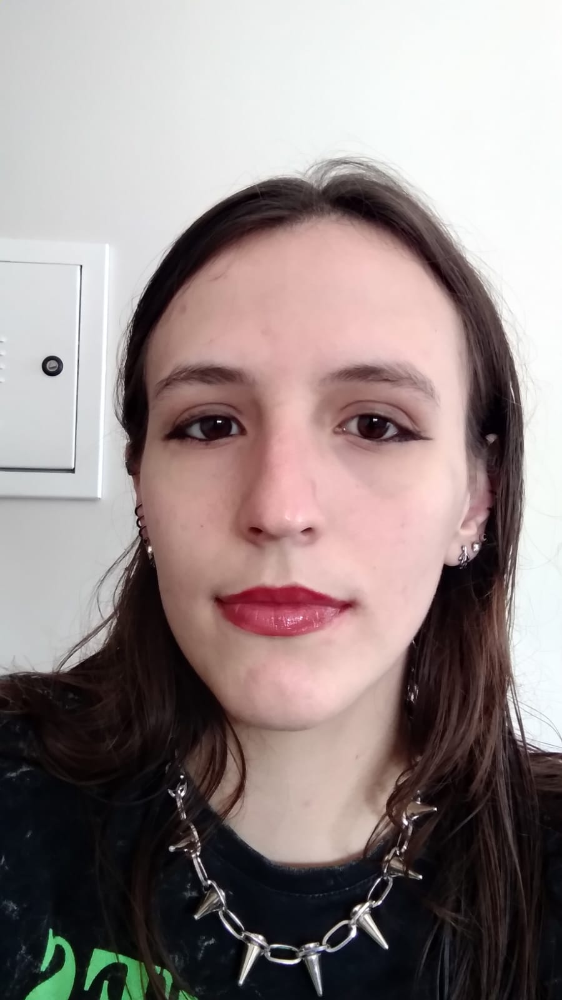

Relátorio de atividades do progama AWS Compass
Olá,
## Apresentação

Olá, sou Ana Claudia Sganzerla ,sou de Maximiliano de Almeida -RS.Atualmente estou cursando o primeiro semestre de Ciência da Computação no IFSUL campus Passo Fundo.Esta é a minha primeira experiência profissional na área da tecnologia,com excessão de alguns cursos de capaçitação que realizei até o momento,como desenvolvimento web e desenvolvimento de jogos.Um dos meus hobbies e interesses é a constante leitura e aprendizado sobre o que há de novo na tecnologia.

## Sprints 

1. [Sprint 1](Sprint%201/README.md)
2. [Sprint 2](Sprint%202/README.md)
3. [Sprint 3](Sprint%203/README.md)
4. ...

