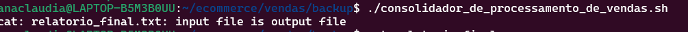

# Etapas
Primeiramente ,acesse seu home do terminal linux e execute
o primeiro arquivo executável
1. [Etapa I](./ecommerce/processamento_de_vendas.sh)

Após ,execute o consolidador de vendas
2. [Etapa II](./consolidador_de_processamento_de_vendas.sh)

Um problema que pode acontecer é esse:

Logo ,antes de executar o consolidador de processamento de vendas,remova o arquivo final com o comando rm relatorio_final.txt para que crie um novo com o mesmo nome 