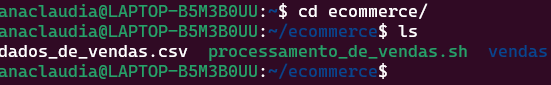
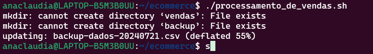
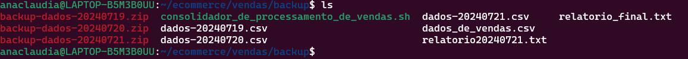
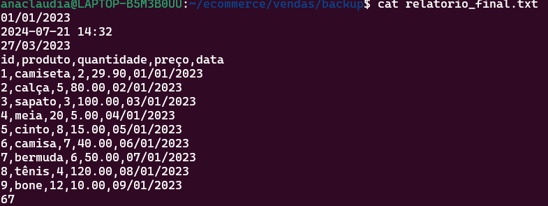

O primeiro passo foi entrar no diretório e executar o arquivo .sh

Este passo é a verificação se os diretórios foram criados,arquivos foram excluidos ,copiados ou zipados.

Este é o arquivo relatório final depois do arquivo executável chamado consolidador_de_processamento_de_vendas.sh ter sido executado e concatenado todos os arquivos chamados relatorio* para dentro dele.

Um problema que pode acontecer é esse:

Logo ,antes de executar o consolidador de processamento de vendas,remova o arquivo final com o comando rm relatorio_final.txt para que crie um novo com o mesmo nome 