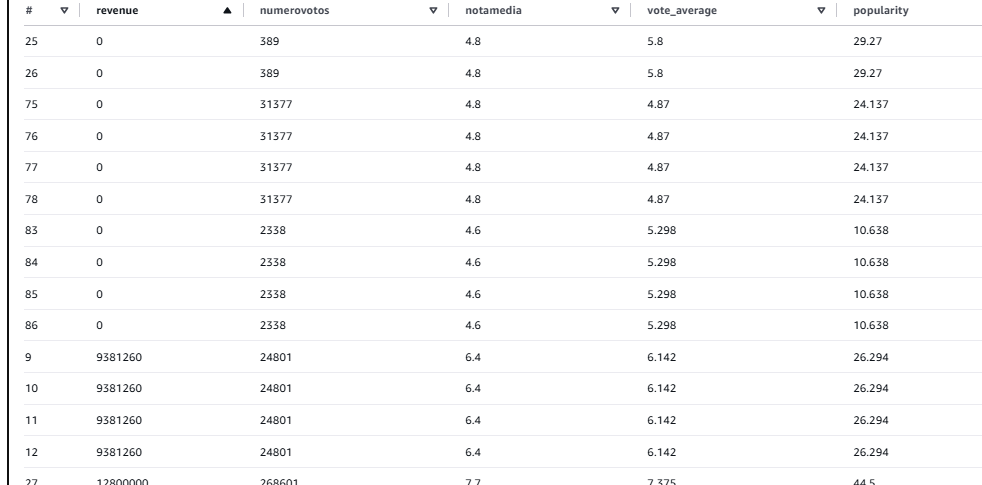
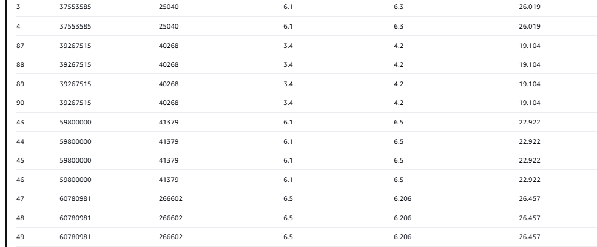
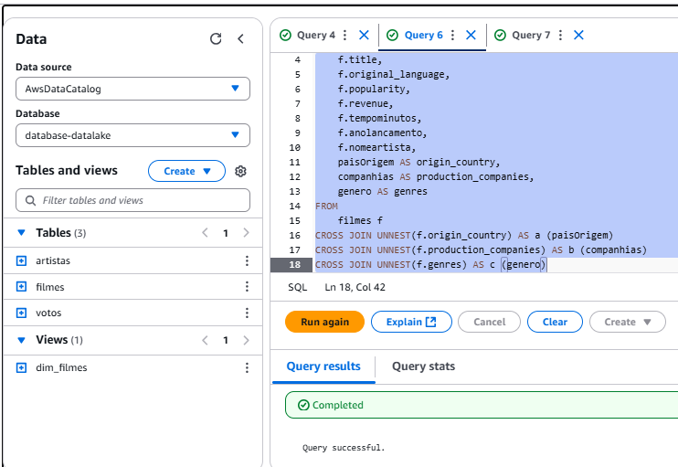
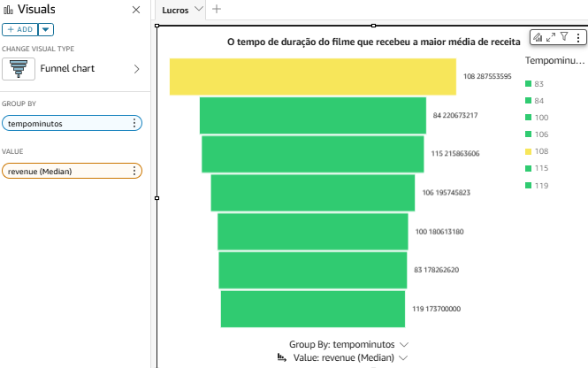
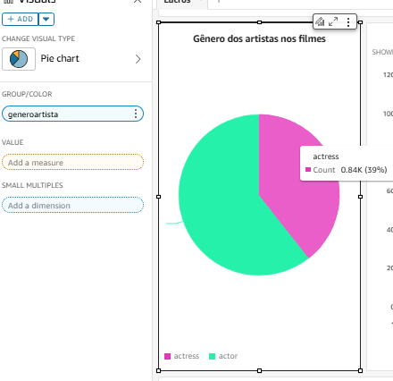
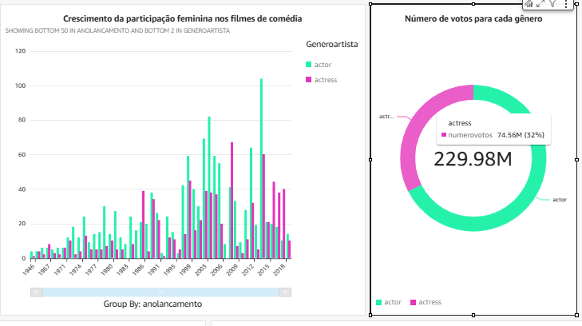
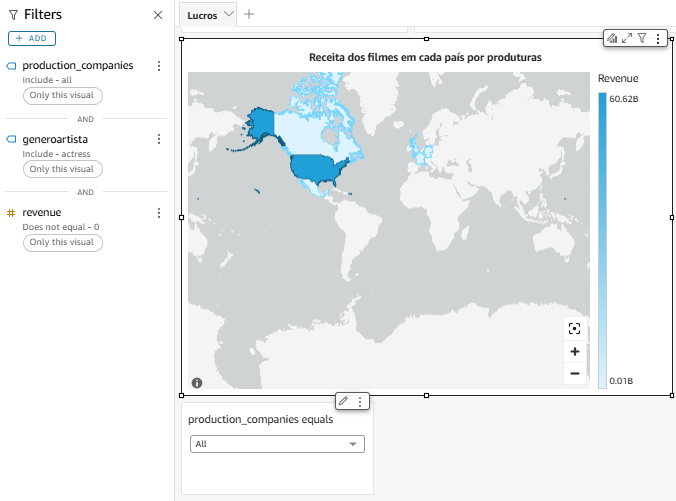
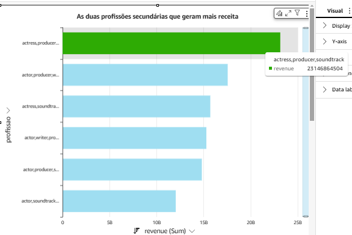
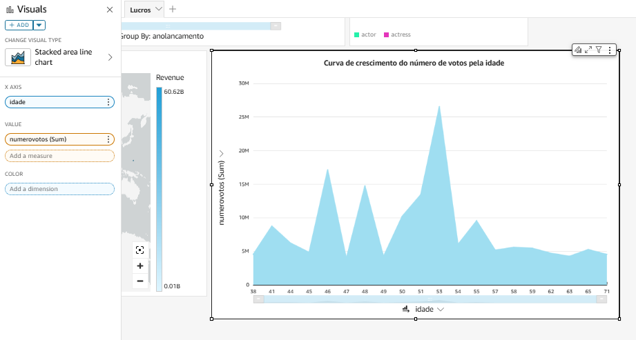

# Desafio
Este desafio envolveu a criação de um dashboard para extrair insights valiosos sobre as perguntas de negócios feitas desde a sprint 6.

## Visão geral do dashborad

Esse dashoboard possui 7 gráficos que respondem 4 perguntas.


## Planejamento do uso de dados
Para saber qual coluna em específica eu usaria da tabela votos,fiz algumas análises pelo Athena por meio de Queries

```sql
SELECT filmes.revenue, votos.numerovotos, votos.notamedia,votos.vote_average,filmes.popularity
FROM filmes
JOIN votos ON filmes.imdb_id = votos.imdb_id

```
Com os resultados da query percebe-se que a coluna como notaMedia ,voteAverage e Popularity não estão diretamente correlacionadas com a coluna revenue,pois a popularidade e a média de avaliação não garante que o filme tenha uma boa receita.Então usei unicamente as colunas numeroVotos e Revenue como métricas do meu dashboard.






## Criação de dimensão
Para facilitar a união das tabelas com joins no QuickSight, foi criada a dimensão dim_filmes. Além disso, foi necessário usar uma abordagem SQL para converter arrays em novas linhas, já que o QuickSight não permite trabalhar com dados em formato de array.

```sql
CREATE OR REPLACE VIEW dim_filmes AS
SELECT 
    f.imdb_id,
    f.title,
    f.original_language,
    f.popularity,
    f.revenue,
    f.tempominutos,
    f.anolancamento,
    f.nomeartista,
    paisOrigem AS origin_country, 
    companhias AS production_companies,
    genero AS genres  
FROM 
    filmes f
CROSS JOIN UNNEST(f.origin_country) AS a (paisOrigem)
CROSS JOIN UNNEST(f.production_companies) AS b (companhias)   
CROSS JOIN UNNEST(f.genres) AS c (genero)
```



## Perguntas Respondidas
Cada pergunta tem uma narrativa, explicação do respectivo gráfico e resultados. Durante as sprints, o trabalho focou exclusivamente em filmes, deixando de lado séries.


# 1- FILMES -Receita
**Introdução:**
Maximizar lucros é essencial em qualquer esforço humano. A análise buscou determinar um "ponto ideal" de duração dos filmes (em minutos) que maximiza a nota média, bem como os fatores que contribuem para maiores receitas, considerando filmes que obtiveram lucros acima da média.
**Desenvolvimento:**
Foi avaliado se existe uma duração consistente que recebe boas avaliações e se contribui para maior receita. O gráfico gerado mostrou a relação entre a duração do filme e a receita média.



**Conclusão**
Filmes com maior receita média têm uma duração ideal de 108 minutos (1h48min), indicando que o tempo de exibição contribui para a lucratividade.

# 2- Sobre genêro dos artistas

**Introdução:**
Ao longo da história, as mulheres foram e continuam sendo vítimas do machismo estrutural presente na sociedade. Isso se reflete também no cinema, onde, por muito tempo, a atuação era exclusiva para homens, enquanto as mulheres eram proibidas de participar. Mesmo após séculos de luta, em gêneros como a comédia, persiste a visão de que as mulheres são "menos engraçadas", tanto em filmes quanto como humoristas. Para explorar mais sobre esse tema, acesse [Por que Achamos que Mulheres não Sabem Fazer Humor](https://nodeoito.com/mulheres-humor-comediantes/). Esse preconceito pode ser comprovado pelos dados, como número de votos e receita dos filmes?
**Desenvolvimento:**
Avaliar se o filme tem maior avaliação de acordo com o gênero .O crescimento da participação feminina aumentou junto com a avaliação dos filmes de comédia ? Se sim,avaliar as produtoras de filmes mais "inclusivas " que tem maior público feminino como artista principal e o país de origem,como também o idioma falado.

# Participação Feminina nos Filmes

## 2.1 Quantidade Total Feminina nos Filmes  
O gráfico abaixo destaca a participação feminina nos filmes, evidenciando que apenas 39% do elenco é composto por mulheres.  

  

## 2.2 Crescimento Feminino ao Longo dos Anos e o Número de Votos  
Embora a participação feminina tenha aumentado ao longo dos anos, o público masculino ainda é predominante.  
- A análise revelou que, enquanto as mulheres representam **39%** da participação nos filmes, os votos relacionados a filmes com maior participação feminina são apenas **32%**.  
- Esses números refletem a existência de preconceitos estruturais.  

  

## 2.3 País de Origem das Produtoras com Base no Lucro  
Mesmo que os dados não tenham corroborado as hipóteses iniciais, foi possível identificar produtoras mais inclusivas e seus respectivos países de origem, usando filtros baseados em lucro.  
Esses resultados podem guiar iniciativas para ampliar a inclusão no cinema.  

  

## Conclusão  
Os dados revelam que, embora a participação feminina no cinema esteja crescendo, ela ainda não se traduz proporcionalmente em reconhecimento ou lucro, reforçando a persistência do preconceito no setor.  
Contudo, ao identificar produtoras mais inclusivas, é possível traçar estratégias para promover maior equidade na indústria cinematográfica.  


# 3-Profissões 

## Profissões Secundárias dos Atores

**Introdução:**  
É imprescindível o constante aprimoramento de profissionais em todas as áreas, incluindo o cinema.  
A pergunta central desta análise é: **Qual profissão secundária dos atores permitiu gerar maior receita nos filmes?**  


**Desenvolvimento:**  
A análise foi realizada com base na soma da receita gerada pelos filmes, associada às profissões secundárias dos atores. Os dados revelam as categorias profissionais que, além de atuar, tiveram maior impacto financeiro nos filmes em que participaram.As profissões são **Produtor ,e Compositor de trilha sonora**.Essas profissões, quando exercidas por atores além de sua função principal, podem agregar valor significativo à produção, seja por meio da visão estratégica do produtor ou pela qualidade emocional adicionada pelas trilhas sonoras.

  

**Conclusão:**  
Os resultados indicam que os atores com profissões secundárias específicas influenciam diretamente no sucesso financeiro dos filmes. Isso reforça a importância de habilidades multifacetadas no cinema para alavancar receitas.  

# 4- Idade

# Etarismo no Cinema

**Introdução:**  

O etarismo no cinema se manifesta de diversas formas, refletindo discriminação e estereótipos associados à idade dos artistas. Frequentemente, atores mais velhos são trocados por atores mais jovens,pois muitas vezes são considerados "velhos demais" para determinados papéis.Veja mais exemplos disso em [Sharon Stone se revolta com etarismo no cinema](https://www.cnnbrasil.com.br/entretenimento/sharon-stone-se-revolta-com-etarismo-no-cinema-nao-sabem-o-que-fazer/)
Essa dinâmica de etarismo no cinema reflete uma visão limitada e excludente, que negligencia a complexidade e o talento de artistas.

**Desenvolvimento:**
Existe uma relação entre idade de artistas e o número de votos do filme, indicando que atores mais jovens ou mais velhos são menos reconhecidos,ou se existe uma "curva de ascensão" em que eles se tornam mais populares depois de certa idade.Aqui se considera a coluna de número de votos.



**Conclusão**
O resultado mostra que tanto artistas mais velhos quanto mais jovens apresentam quase o mesmo número de votos, enquanto artistas de meia-idade, entre 49 e 53 anos, demonstram uma curva de ascensão. Isso evidencia que não deve haver distinção em relação à idade dos artistas, pois a popularidade não é definida apenas pela faixa etária, mas pela habilidade e oportunidade de atuar em papéis significativos.


# Conclusão do Dashboard

O dashboard desenvolvido forneceu uma visão abrangente e detalhada sobre diversos aspectos da indústria cinematográfica, respondendo perguntas chave relacionadas à receita dos filmes, à participação feminina, às profissões dos artistas e à idade dos mesmos.

1. **Receita dos Filmes:**  
   Foi identificado que a duração dos filmes tem um impacto direto na receita, com os filmes que possuem exatamente 108 minutos de duração apresentando as maiores receitas médias. Isso indica que a escolha do tempo de exibição pode ser um fator importante para maximizar o sucesso financeiro de um filme.

2. **Participação Feminina:**  
   A análise mostrou que, embora a participação feminina esteja crescendo ao longo dos anos, ainda existe uma discrepância significativa no número de votos recebidos em comparação com os filmes dominados por artistas masculinos. Além disso, verificou-se que, embora a participação feminina aumente, o preconceito ainda se reflete na avaliação pública dos filmes, com uma subrepresentação de mulheres nas produções mais lucrativas.

3. **Profissões dos Artistas:**  
   A análise revelou que artistas que desempenham funções secundárias, como produtores e responsáveis pela trilha sonora, também influenciam diretamente o número de votos e a receita dos filmes. Isso destaca a importância de considerar a contribuição coletiva para o sucesso de um filme, além da atuação principal.

4. **Idade dos Artistas:**  
   A análise sobre a idade dos artistas revelou uma "curva de ascensão" entre artistas de meia-idade, sugerindo que a popularidade de um ator tende a aumentar com a experiência. Por outro lado, tanto artistas muito jovens quanto mais velhos têm um número de votos semelhante, reforçando a ideia de que a idade não deve ser um fator limitante para o reconhecimento e sucesso no cinema.

Em resumo, o dashboard mostrou que fatores como a duração do filme, a diversidade de papéis e a experiência dos artistas têm um impacto significativo nas métricas de sucesso, como a receita e o número de votos. No entanto, a análise também evidenciou que o cinema ainda enfrenta desafios em relação à equidade de gênero e ao reconhecimento de artistas de diferentes faixas etárias, demonstrando a necessidade de uma maior inclusão e valorização da diversidade em todas as suas formas.


