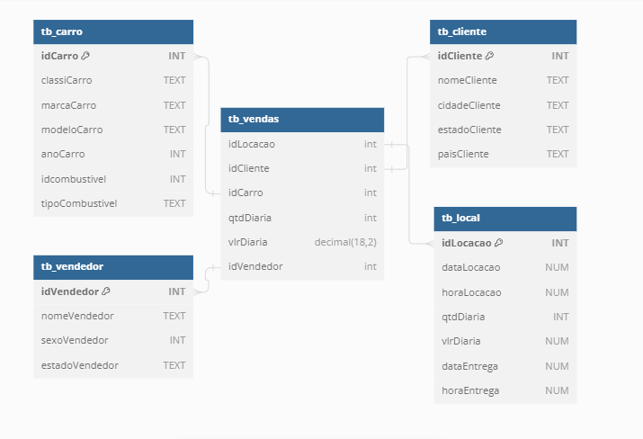

```PostgreSQL

Table "tb_carro" {
  "idCarro" INT
  "classiCarro" TEXT
  "marcaCarro" TEXT
  "modeloCarro" TEXT
  "anoCarro" INT
  "idcombustivel" INT
  "tipoCombustivel" TEXT
}

Table "tb_cliente" {
  "idCliente" INT
  "nomeCliente" TEXT
  "cidadeCliente" TEXT
  "estadoCliente" TEXT
  "paisCliente" TEXT
}

Table "tb_local" {
  "idLocacao" INT
  "dataLocacao" NUM
  "horaLocacao" NUM
  "qtdDiaria" INT
  "vlrDiaria" NUM
  "dataEntrega" NUM
  "horaEntrega" NUM
}

Table "tb_vendas" {
  "idLocacao" int [pk]
  "idCliente" int
  "idCarro" int
  "qtdDiaria" int
  "vlrDiaria" decimal(18,2)
  "idVendedor" int
}

Table "tb_vendedor" {
  "idVendedor" INT
  "nomeVendedor" TEXT
  "sexoVendedor" INT
  "estadoVendedor" TEXT
}
```
