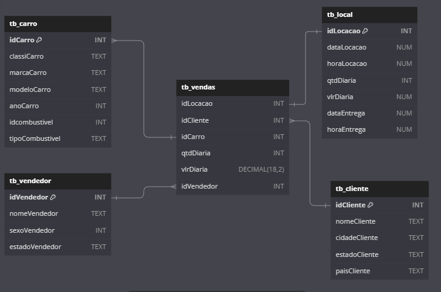
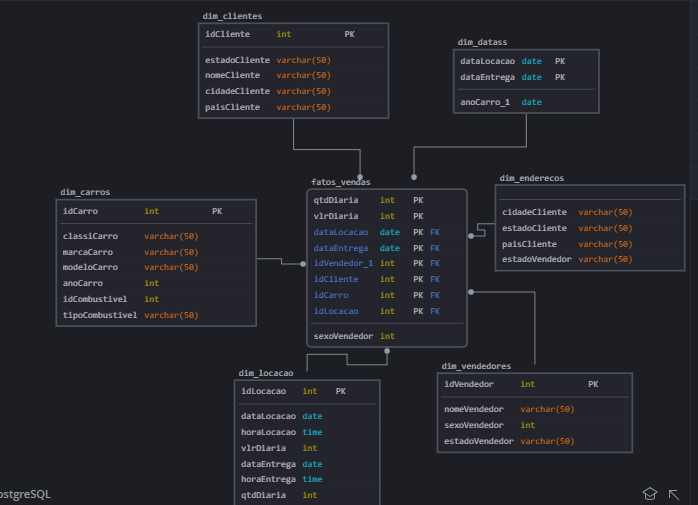

Modelo Relacional normalizado
```sql

Table "tb_carro" {
  "idCarro" INT [pk]
  "classiCarro" TEXT
  "marcaCarro" TEXT
  "modeloCarro" TEXT
  "anoCarro" INT
  "idcombustivel" INT
  "tipoCombustivel" TEXT
}

Table "tb_cliente" {
  "idCliente" INT [pk]
  "nomeCliente" TEXT
  "cidadeCliente" TEXT
  "estadoCliente" TEXT
  "paisCliente" TEXT
}

Table "tb_local" {
  "idLocacao" INT [pk]
  "dataLocacao" NUM
  "horaLocacao" NUM
  "qtdDiaria" INT
  "vlrDiaria" NUM
  "dataEntrega" NUM
  "horaEntrega" NUM
}

Table "tb_vendas" {
  "idLocacao" INT 
  "idCliente" INT
  "idCarro" INT
  "qtdDiaria" INT
  "vlrDiaria" DECIMAL(18,2)
  "idVendedor" INT
}

Table "tb_vendedor" {
  "idVendedor" INT [pk]
  "nomeVendedor" TEXT
  "sexoVendedor" INT
  "estadoVendedor" TEXT
}
Ref: tb_carro.idCarro> tb_vendas.idCarro
Ref: tb_vendas.idVendedor> tb_vendedor.idVendedor
Ref: tb_local.idLocacao - tb_vendas.idLocacao
Ref: tb_cliente.idCliente < tb_vendas.idCliente

```


Modelo Dimensional 
```sql
CREATE VIEW dim_datass AS
    SELECT dataLocacao,
           dataEntrega
      FROM tb_local;
      UNION SELECT anoCarro
      from tb_carros

CREATE VIEW enderecos AS
    SELECT cidadeCliente,
           estadoCliente,
           paisCliente
      FROM tb_cliente
    UNION
    SELECT estadoVendedor
      FROM tb_vendedor;


-- Visualizar: fatos
CREATE VIEW fatos AS
    SELECT qtdDiaria,
           vlrDiaria,
           idLocacao,
           idCliente,
           idCarro,
           idVendedor
      FROM tb_vendas
    UNION
    SELECT sexoVendedor
      FROM tb_Vendedor
    UNION
    SELECT idCombustivel
      FROM tb_carros;

create view  dim_locacao as
select distinct 
idLocacao,
dataLocacao,
horaLocacao,
qtdDiaria,
vlrDiaria,
dataEntrega,
horaEntrega
from tb_local

create view dim_carros as 
select distinct
idCarro,
classiCarro,
marcaCarro,
modeloCarro,anoCarro,
idCombustivel,
tipoCombustivel
from tb_carros

 create view dim_clientes as 
select distinct
idCliente,
nomeCliente,
cidadeCliente,
estadoCliente,paisCliente
from tb_clientes

create view dim_vendedores as 
select distinct 
idVendedor,
nomeVendedor,
sexoVendedor,
estadoVendedor
from tb_vendedor
```

