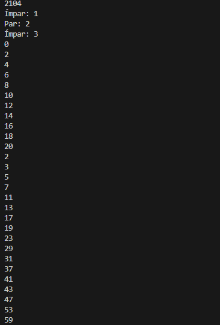
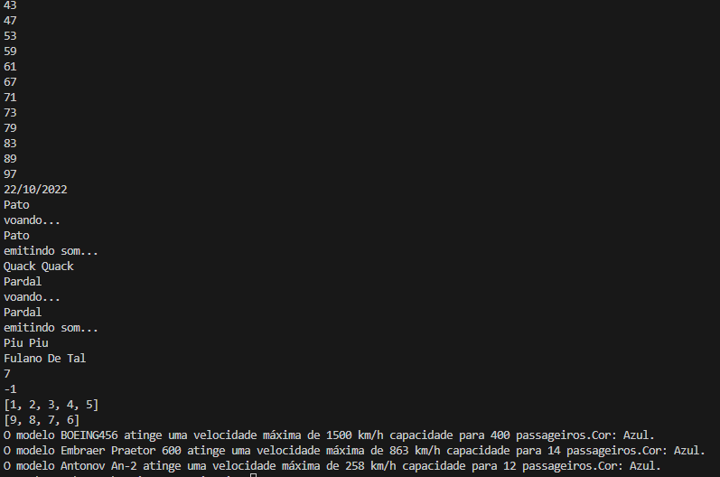
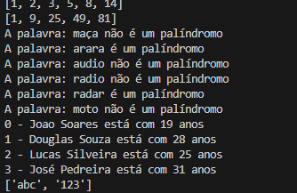
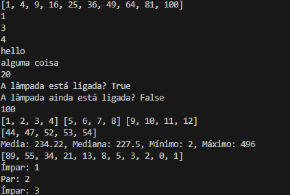
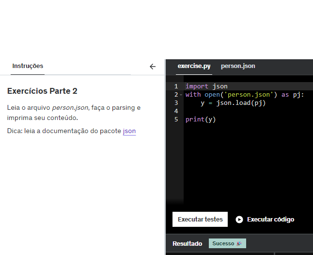
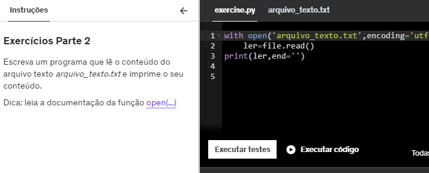

Nesta pasta há dois arquivos com os códigos que evidenciam a parte 1 e a parte 2 dos exercícios que foram feitos na Udemy,além dos arquivos txt exigidos na seção 5
## Parte 1 dos exercícios(1...5,21...25)

## Parte 2 dos exercícios(6...20)

## Arquivos .txt resultantes
1. Etapa 1
[1](./etapa-1.txt)

2. Etapa 2
[2](./etapa-2.txt)

3. Etapa 3
[3](./etapa-3.txt)

4. Etapa 4
[4](./etapa-4.txt)

5. Etapa 5
[4](./etapa-5.txt)

