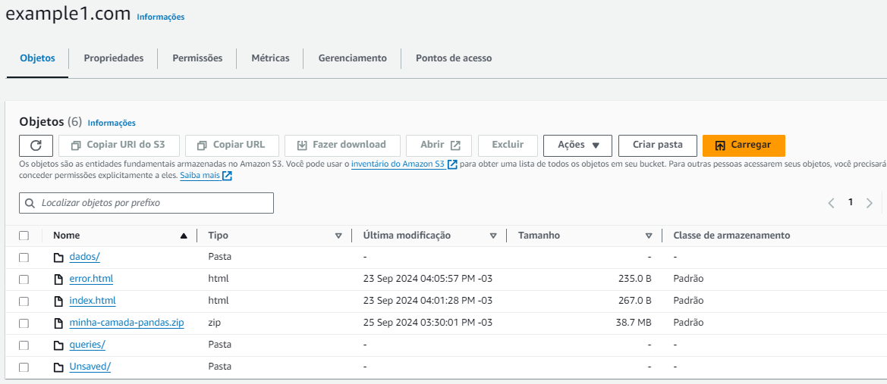
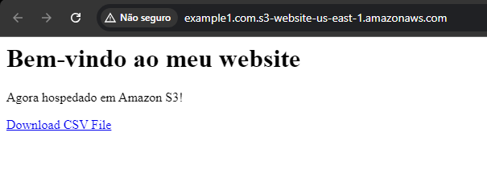
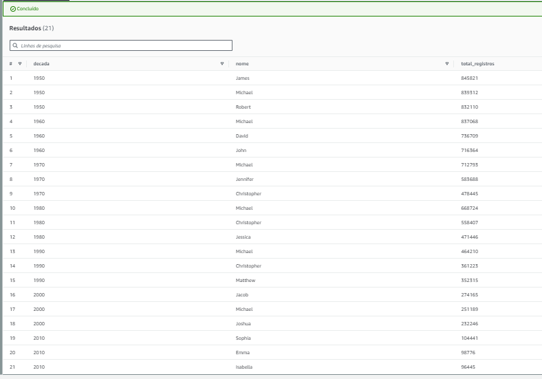
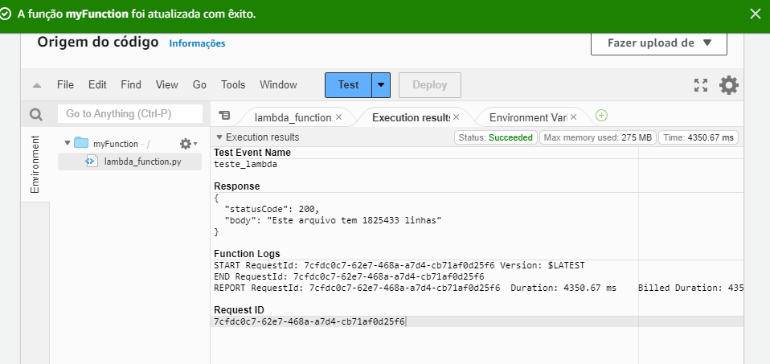
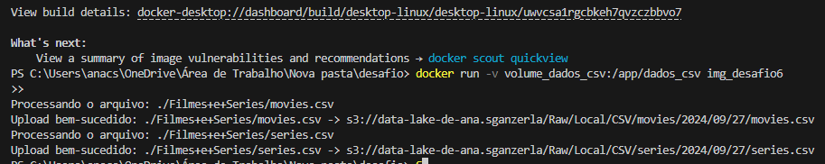
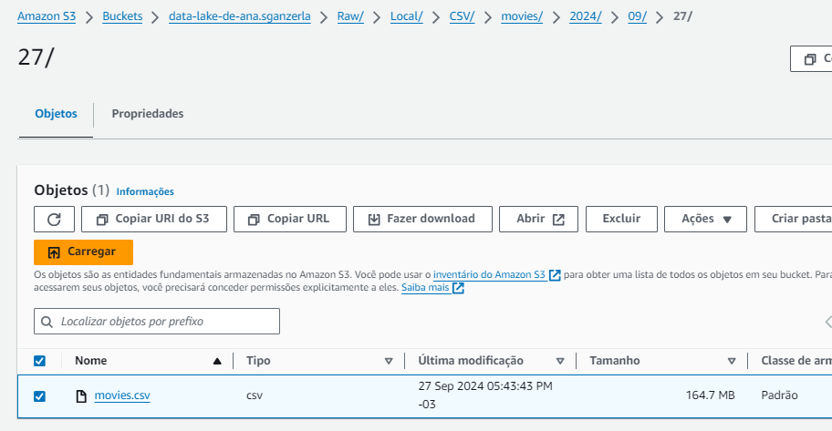
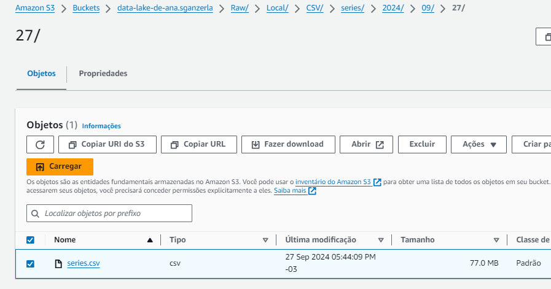

# Evidências
Nesta pasta estão contidas as provas de execução dos exercícios e do desafio.
## Todos os objetos criados nos exercícios em um bucket:

## Exer 1

## Exer 2

## Exer 3

## Evidência de execução do arquivo python

## Evidencias dos arquivos carregados no bucket

