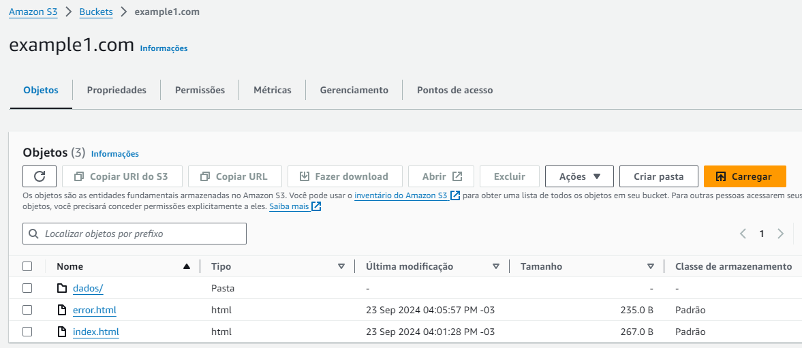
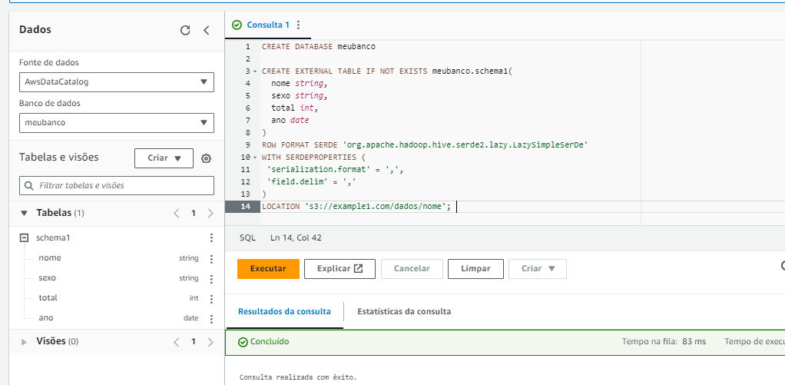
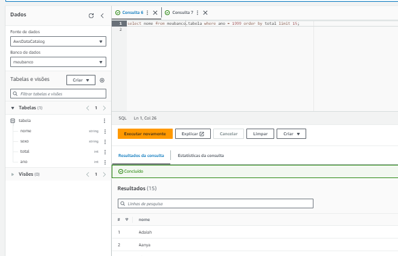
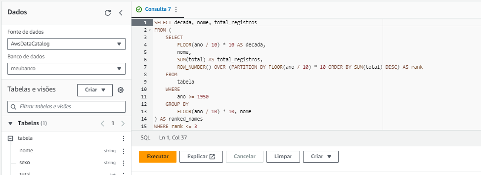
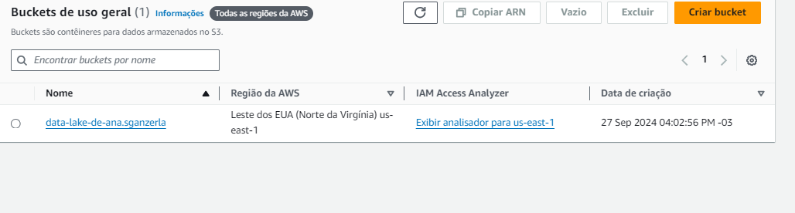

## Exercícios :
Nesta sprint houve 3 exercícios na aws,com o objetivo de praticar os conceitos aprendidos na nuvem,como hospedar um site,executar queries,e criar função lambda com camadas.(_Os resultados dessas atividades estarão na pasta de evidencias de execução_)

### Exercício 1
Efetuado totalmente no console aws,usando o serviço s3 na criação de um bucket que servisse como **Hospedagem de site estático**,abaixo está o print e os arquivos indexados no bucket:

[index.html](./index.html)
[error.html](./error.html)

## Exercício 2
Neste exercício foi usado o serviço Athena ,que é capaz de se conectar a um objeto do bucket do serviço s3 e realizar consultas de dados.Abaixo estão as consultas em sql realizadas:
### Query que cria o banco de dados e uma tabela com colunas e seus respectivos tipos:
**Obs**ao criar a tabela ,nomeada de schema1,ocorreu um erro ao direcionar o bucket,por isso considere apenas nesta query como se o nome da tabela fosse tabela ,assim como está nas outras queries.

### Teste com os dados da consulta:

### Consulta que lista os 3 nomes mais usados em cada década desde o 1950 até hoje.

## Exercício 3
Neste exercício exigiu a utilização de docker na função lambda criada no laboratório aws.
**Arquivos criados com base nas instruções fornecidas:**
[dockerfile](./pastaDocker/dockerfile)
[arquivoCompactadoCamada](./pastaDocker/minha-camada-pandas.zip)

## Exclusão do bucket usado:
Neste print percebe-se a existência somente de um bucket que será usado para o desafio final,e não o **example1.com**:
