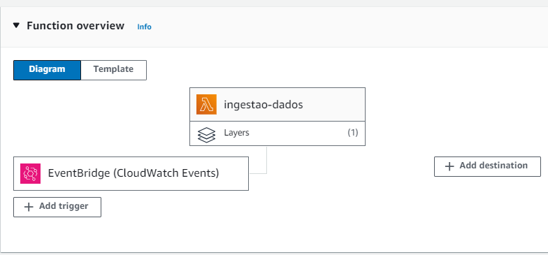
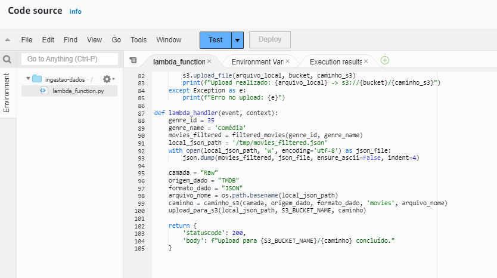
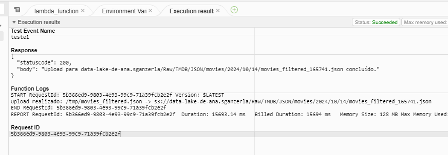
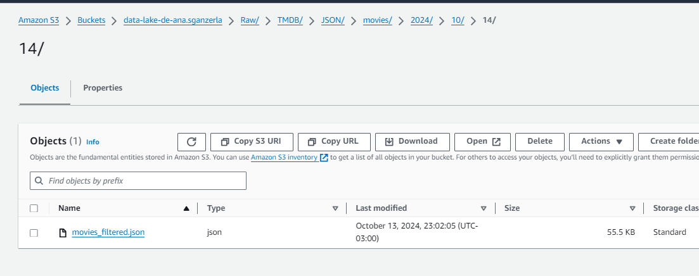
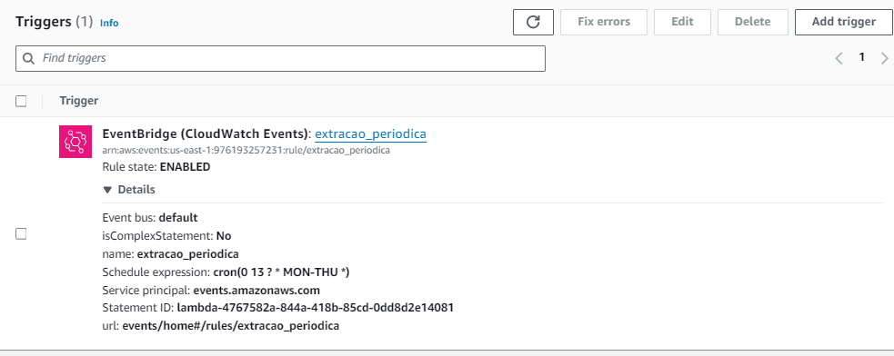

# Evidências

## Evidência do diagrama da função

## Evidência do função principal lambda

## Evidência do função executada

## Evidência dos arquivos no s3

## Evidência da extração periódica

## Evidência do formato de arquivo json

