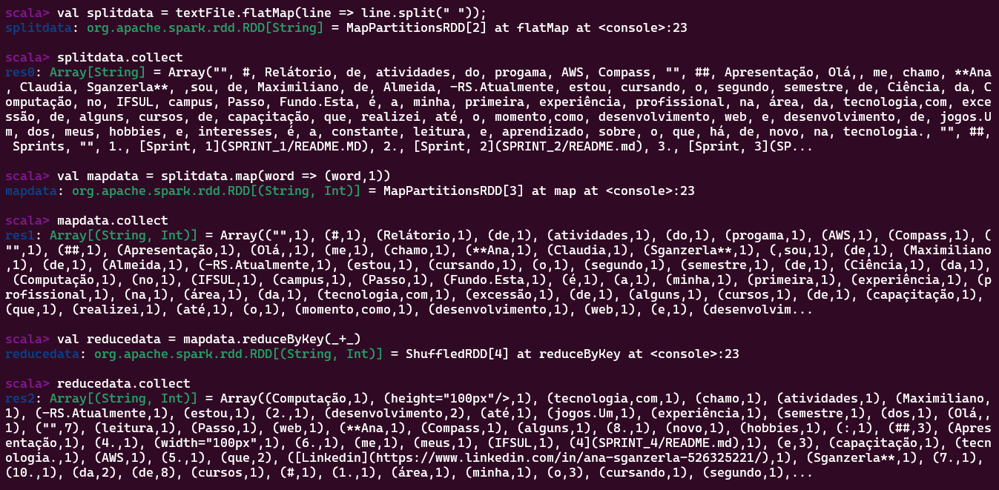
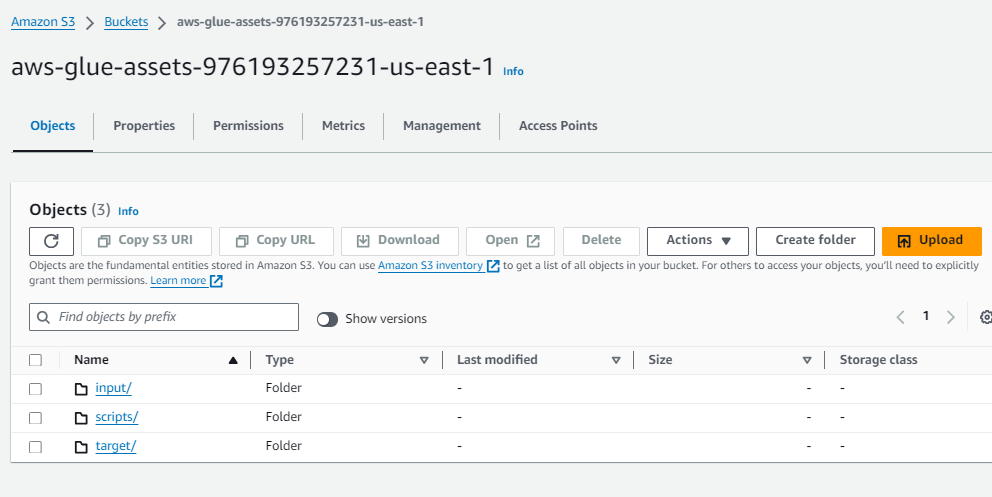
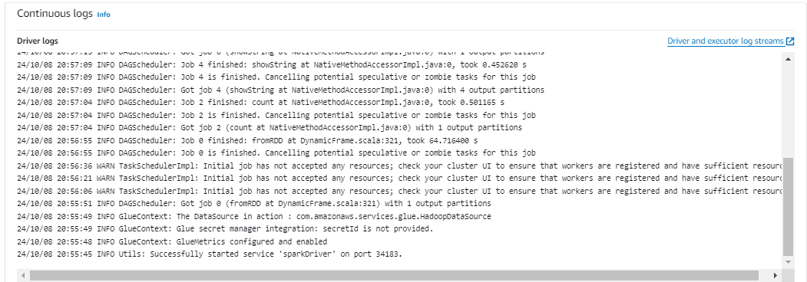
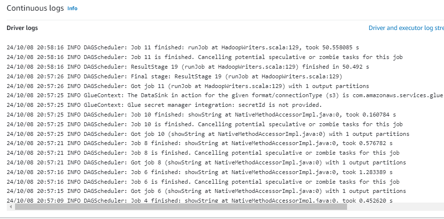
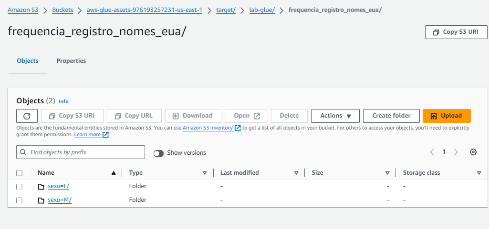
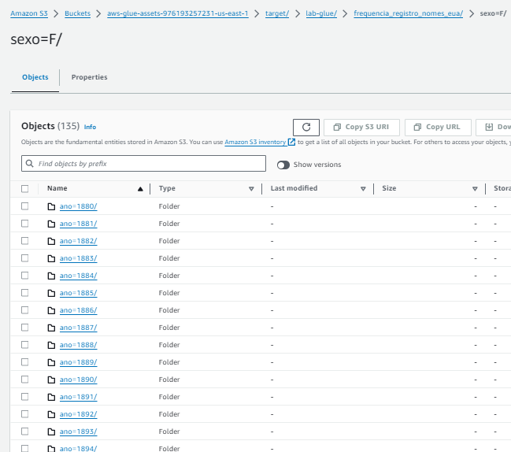
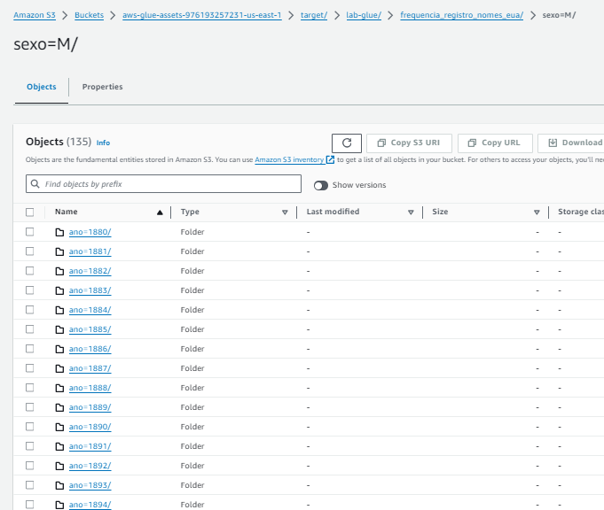
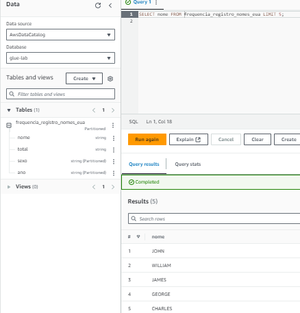

# Exercícios
Nesta sprint houve exercícios que envolveram a prática de spark,um framework eficiente para análise e processamento de dados,e uso do serviço da Amazon Glue,muito usado para ETL.

## Exercício Spark
A tarefa era usar o spark-shell,que tem scala como sua linguagem nativa para ler a quantidade de repetições das palavras de um arquivo **README.md** deste repositório.Ao procurar a documentação ,encontrei um exemplo de como fazer neste site:[apache-spark-example](https://www.javatpoint.com/apache-spark-char-count-example).Precisei fazer através do wsl ,pois não consegui referenciar o arquivo localmente com a imagem docker sugerida no enunciado do exercício.

<div style="text-align:center"> **Os comandos foram:** </div>

```shell
# para iniciar o spark
start-master.sh 
# abrir o spark-shell
spark-shell 
# definir o caminho do arquivo
val textFile = sc.textFile("/home/anaclaudia/README.md")
# visualizar o arquivo
textFile.collect
# definir palavras individuais por espaços,e dividir cada palavra por vírgulas como um índice de um array 
val splitdata = data.flatMap(line => line.split(""));  
# visualizar o arquivo
splitdata.collect
# atribuir valor 1 para cada palavra para ser possivel contá-las.
val mapdata = splitdata.map(word => (word,1))
# resumir os dados gerados:
val reducedata = mapdata.reduceByKey(_+_);
# ler o resultado
reducedata.collect

```
O resultado esperado é esse:



## Exercício Glue

Este exercício envolveu a criação de regras para user IAM,como configurar permissões no AWS LAKE FORMATION ,criar um novo job e crawler no aws glue.

<div style="text-align:center"> **Etapas:** </div>

1. ## Criação de sub-diretórios
Pasta target : parâmetro do job que será o caminho onde irá ser gravado o conteúdo
Pasta input : parâmetro do job onde está localizado o arquivo csv,e será acessado na criação do dataFrame.


2. ## Construção do Job Glue
Ao seguir as orientações do exercício,formulei o script job como estava no modelo.Apenas com 2 bibliotecas a mais a serem importadas,pois DataFrame Dinâmicos não aceitam operações de agregação ,como groupBy .Então,para aumentar a eficiência do código ,evitei fazer repetidas transformações de dataFrames e deixei apenas para o início e o final.

```py
import sys
from pyspark.context import SparkContext
from awsglue.context import GlueContext
from awsglue.transforms import *
from awsglue.utils import getResolvedOptions
from awsglue.job import Job
from pyspark.sql.functions import upper
from awsglue.dynamicframe import DynamicFrame  # Importando DynamicFrame

# @params: [JOB_NAME, S3_INPUT_PATH, S3_OUTPUT_PATH]
args = getResolvedOptions(sys.argv, ['JOB_NAME', 'S3_INPUT_PATH', 'S3_TARGET_PATH'])

sc = SparkContext()
glueContext = GlueContext(sc)
spark = glueContext.spark_session
job = Job(glueContext)
job.init(args['JOB_NAME'], args)

source_file = args['S3_INPUT_PATH']
target_path = args['S3_TARGET_PATH']
# Lendo o arquivo CSV no S3
df = glueContext.create_dynamic_frame.from_options(
    connection_type="s3",
    connection_options={"paths": [source_file]},
    format="csv",
    format_options={"withHeader": True, "separator": ","}
)

# 1. Imprimindo o schema do DataFrame
df.printSchema()

# Convertendo para DataFrame do Spark
spark_df = df.toDF()

# 2. Alterando os valores da coluna 'nome' para maiúsculas
df_upper = spark_df.withColumn("nome", upper(spark_df["nome"]))

# 3. Imprimindo a contagem de linhas
total_linhas = df_upper.count()
print("Total de linhas: ", total_linhas)

# 4. Agrupando por 'ano' e 'sexo' e imprimindo a contagem de nomes pelo ano mais recente
df_grouped = df_upper.groupBy(['ano', 'sexo']).count().orderBy('ano', ascending=False)
df_grouped.show()

# 5. Nome feminino com mais registros e o ano que ocorreu
female_max = df_upper.filter(df_upper['sexo'] == 'F').groupBy(['nome', 'ano']).count().orderBy('count', ascending=False).limit(1)
female_max.show()

# 6. Nome masculino com mais registros e o ano que ocorreu
male_max = df_upper.filter(df_upper['sexo'] == 'M').groupBy(['nome', 'ano']).count().orderBy('count', ascending=False).limit(1)
male_max.show()

# 7. Total de registros para cada ano
total_per_year = df_upper.groupBy(['ano', 'sexo']).count().orderBy('ano').limit(10)
total_per_year.show()

# 8. Convertendo o DataFrame de volta para DynamicFrame
dynamic_df = DynamicFrame.fromDF(df_upper, glueContext, "dynamic_df")

# 9. Gravando o conteúdo com nome em maiúsculo no S3
glueContext.write_dynamic_frame.from_options(
    frame=dynamic_df,
    connection_type="s3",
    connection_options={
        "path": f"{target_path}/lab-glue/frequencia_registro_nomes_eua",
        "partitionKeys": ["sexo", "ano"]
    },
    format="json"
)

# Finalizando o job
job.commit()
```
3. ## Logs de execução 
Mostra tudo o que ocorreu na execução do job ,sendo retornado cada impressão pedida no formato do dado ,como showstring 




4. ## Dados alocados nos subdiretórios 







5. ## Visualizar a tabela criada e os dados nela
Tabela criada por meio da criação de um crawler,e após conceber as permissões para usúario IAM no serviço Lake formation em Data Lake Permissions.




