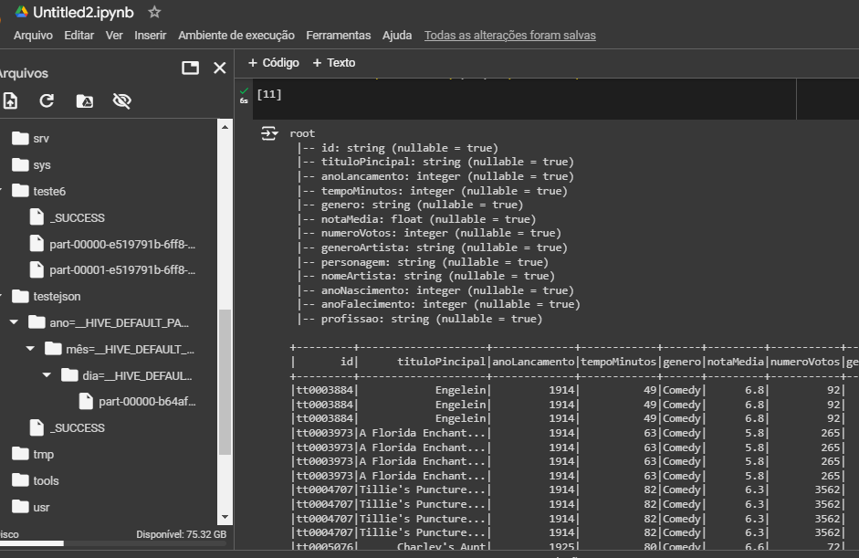
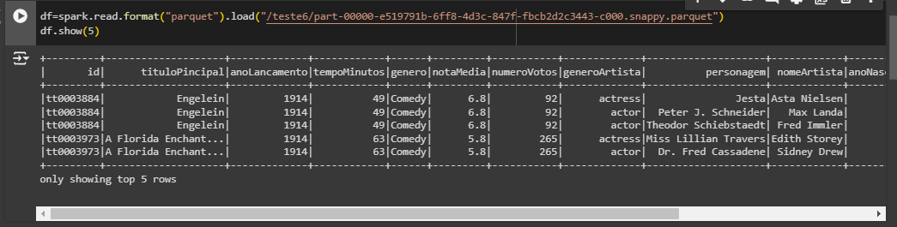
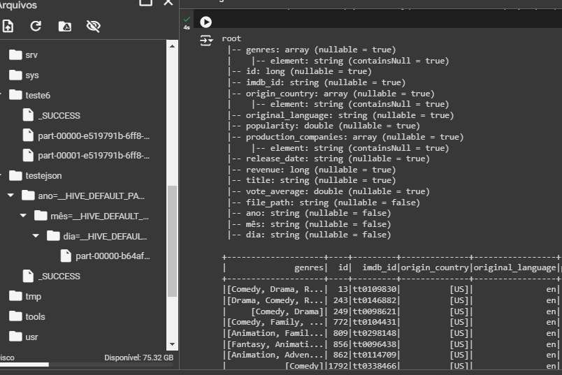
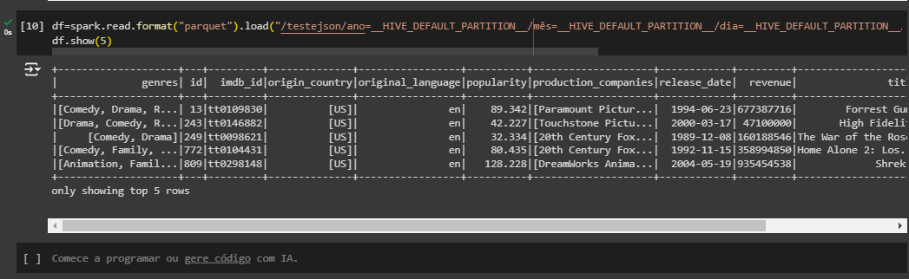
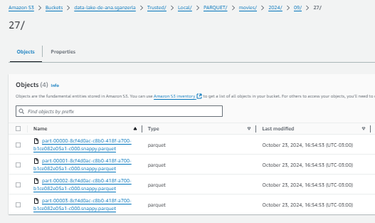
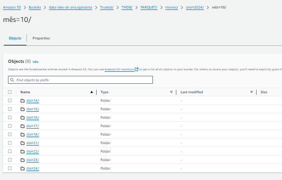
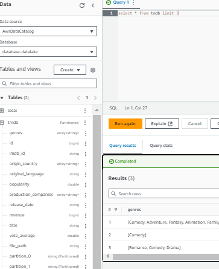

# 🏆 Desafio de Processamento de Dados com PySpark e AWS Glue

Bem-vindo! Este documento detalha as **evidências** da execução do desafio de processamento de dados, que envolve a leitura de arquivos CSV e JSON, transformação dos dados utilizando PySpark, e armazenamento no formato Parquet. Além disso, os dados foram validados na **camada Trusted** e disponibilizados por meio do **AWS Glue Data Catalog**, acessíveis pelo **Athena**. 

## 🔄 Fluxo do Processo

1. **Leitura dos arquivos** (CSV e JSON)
2. **Limpeza e transformação** dos dados com PySpark
3. **Armazenamento** dos dados transformados no formato Parquet
4. **Verificação** dos arquivos gerados na camada Trusted
5. **Catalogação** das tabelas no AWS Glue Data Catalog
6. **Consulta** dos dados utilizando o Athena

---

## 1️⃣ Limpeza e Conversão de Arquivos

### 📂 CSV -> Parquet

Abaixo está a evidência da execução do job PySpark que processou os arquivos **CSV** e converteu para **Parquet**:

### 🔍 Esquema do Parquet gerado a partir do CSV

Após a conversão, verificamos o esquema do arquivo Parquet gerado:

---

### 📂 JSON -> Parquet

Evidência da execução do job PySpark que processou os arquivos **JSON** e gerou os arquivos no formato **Parquet**:

### 🔍 Esquema do Parquet gerado a partir do JSON

Aqui está a verificação do esquema do arquivo Parquet gerado a partir dos dados JSON:

---

## 2️⃣ Verificação dos Arquivos na Camada Trusted

Após a execução dos jobs de transformação, os arquivos resultantes foram movidos para a **camada Trusted**, que contém os dados validados e prontos para uso.

### 🖥️ Verificação dos arquivos na pasta local:

### ☁️ Verificação dos arquivos na pasta "tmdb" no bucket S3:

---

## 3️⃣ Database e Tabelas no AWS Glue Data Catalog

Foi criado um **Database** no AWS Glue Data Catalog para organizar os dados transformados, permitindo o acesso por meio de **Athena**. Abaixo está a evidência do catálogo e das tabelas geradas:

---

## 🎯 Conclusão

O desafio foi executado com sucesso, utilizando PySpark para processar grandes volumes de dados de diferentes formatos, transformando-os em Parquet e armazenando na camada Trusted. O uso do **AWS Glue Data Catalog** e do **Athena** garante fácil acesso e consulta aos dados, proporcionando uma solução escalável e eficiente para processamento de dados em larga escala. 🚀
