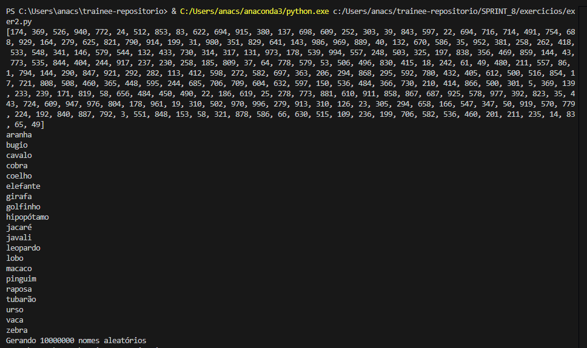
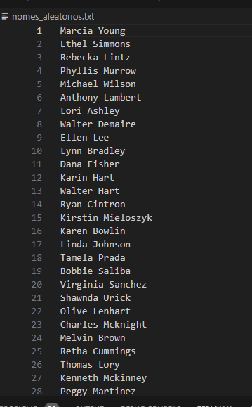
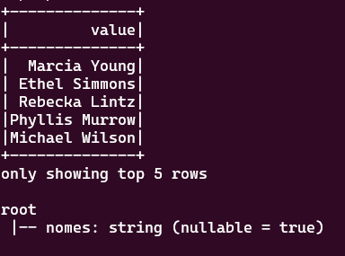
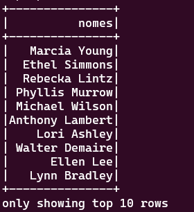
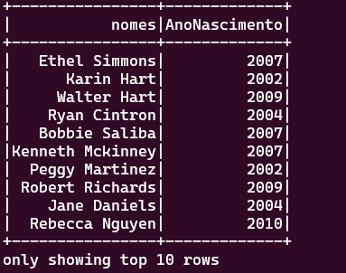
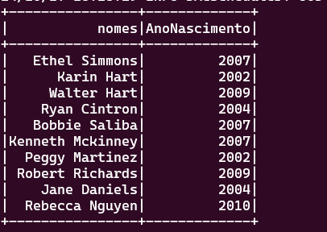
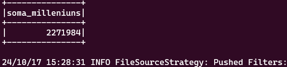
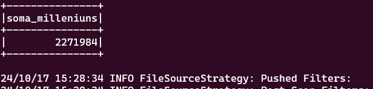
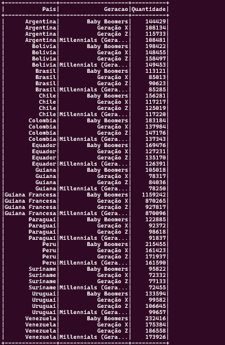

# Exercicios :
Nesta sprint foi praticado exercícios de python e spark-sql como forma de revisão para tudo o que foi visto até a sprint atual.

## Exercicio python:
O exercício abordou o uso de várias bibliotecas usuais para a geração e massa de dados para,posteriormente,escrever um arquivo.O [exer2.py](exer2.py) foi um só dividido por etapas ,assim como no enunciado.



### Arquivo animais.csv gerado : 

[animais.csv](animais.csv)

## Verificação do conteúdo do arquivo nomes_aleatorios.txt




## Exercício Sql-Spark:
Para gerar um script e executá-lo ao mesmo tempo no subsistema windows-ubuntu,utilizei a extensão [https://code.visualstudio.com/docs/remote/wsl](https://code.visualstudio.com/docs/remote/wsl) para programar no vscode ,e o comando ```sh code .``` no terminal para abrir uma sessão no vscode.

O [script.py](exer3.py) está dividido por etapas ,assim como foi exigido no enunciado.
Para executar o script no terminal eu usei o comando shell ```sh spark-submit exer3.py``` para iniciar a sessão spark e gerar os DataFrames.
As evidências de execução são:
1. ### 3.1 (listar 5 linhas)
_Obs:O printSchema da etapa 3.2 apareceu junto ao metodo .show(5)_


2. ### 3.2 (listar 10 linhas)


3. ### 3.6 (método select para mostrar as pessoas que nasceram neste século)


4. ### 3.7 (spark-sql para mostrar as pessoas que nasceram neste século)


5. ### 3.8 (método select para contar o número de pessoas que são milleniuns)


6. ### 3.9 (spark-sql para contar o número de pessoas que são milleniuns)


7. ### 3.10 (mostrar todas as linhas por pais a quantidade de gerações ,ordenada por Pais ,Geração e Quantidade)


### Exercício TMDB
Este exercício não foi considerado para fazer.

