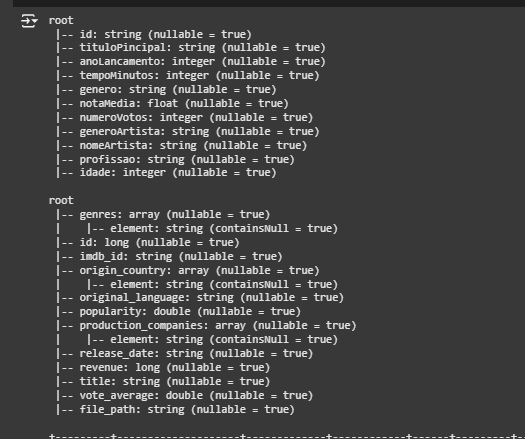
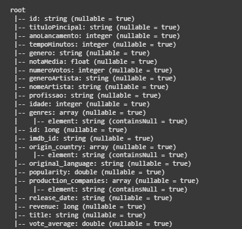
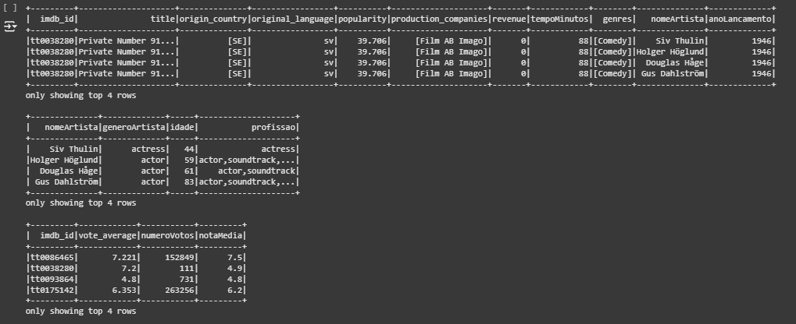
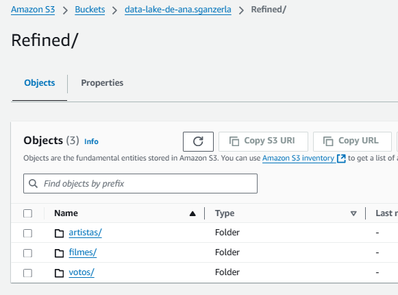
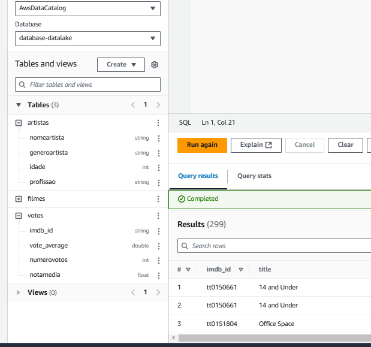

# 📊 Desafio de ETL com AWS Glue e Athena

Este projeto é um exemplo prático de modelagem e processamento de dados com o **AWS Glue**. Abaixo estão as evidências do fluxo completo de execução, incluindo a modelagem, união de dados, salvamento no S3 e ingestão no **Amazon Athena**.

---

## 🔄 Fluxo do Job de ETL

1. **Schemas dos DataFrames Ajustados**  
   Estrutura dos DataFrames que foram unidos em um só utilizando **inner join**.
   
   

2. **Schema do Novo DataFrame Criado**  
   O novo schema representa a estrutura final do DataFrame após a união.

   

3. **Tabelas Criadas na Modelagem**  
   Essas são as tabelas geradas com base na modelagem aplicada.

   

4. **Armazenamento na Camada Refined do S3**  
   Os dados processados foram salvos na camada Refined do bucket no S3, como evidenciado abaixo:

   

5. **Tabelas no Amazon Athena**  
   Abaixo estão as tabelas populadas no **Amazon Athena**, criadas através de **crawlers** configurados para cada tabela da camada Refined.

   

---

## 🚀 Considerações Finais

Este projeto exemplifica o uso das ferramentas AWS Glue e Athena para ingestão, transformação e disponibilização de dados em um formato analítico.
